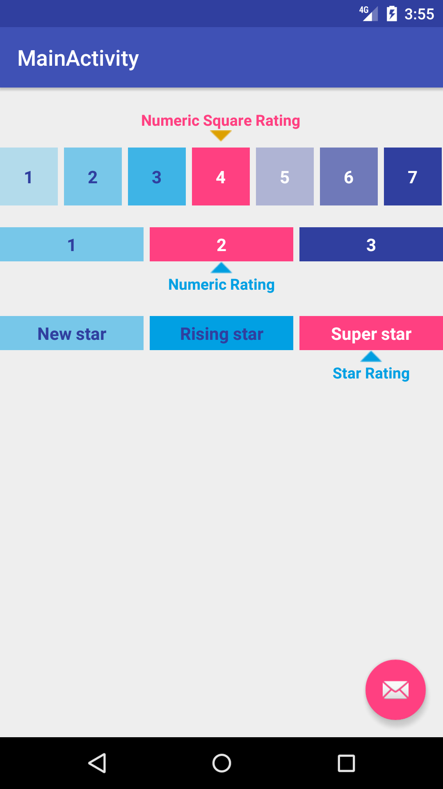

IndicatorRatingBar for Android
==========================

Standalone Android widget for custom rating bar that uses square or rectangle cell with the top/bottom indicator text. The indicator text is only show if the selected rate is set.



Usage
-----

###For simple numeric rating bar

Include `IndicatorRatingBar` in your layout XML.

```xml
<com.helado.indicatorratingbar.IndicatorRatingBar
        android:id="@+id/indicator_rating_view_1"
        android:layout_width="match_parent"
        android:layout_height="wrap_content"
        android:layout_marginTop="20dp"
        android:layout_marginBottom="20dp"
        custom:rateType="numeric"
        custom:rateShape="square"
        custom:minRate="1"
        custom:maxRate="7"
        custom:selectedRate="4"
        custom:showIndicator="true"
        custom:indicatorPosition="indicatorDown"
        custom:indicatorTitle="Numeric Square Rating">
    </com.helado.indicatorratingbar.IndicatorRatingBar>
```

###For custom rating values

Set the values in code

```java
IndicatorRatingBar indicatorRatingBar = (IndicatorRatingBar) findViewById(R.id.indicator_rating_view_3);
indicatorRatingBar.setRateList(Arrays.asList("New star", "Rising star", "Super star"));
indicatorRatingBar.setSelectedRate("Super star");
```

Custom attributes
-----

```
rateType : numeric (default) | custom
rateShape : rectangle (default) | square
minRate : [0 - 9]
maxRate : [0 - 9] && maxRate > minRate
selectedRate : [minRate, maxRate]
indicatorPosition : UP | DOWN
indicatorTitle : Title text of indicator bar
showIndicator : true (default) | false
```

